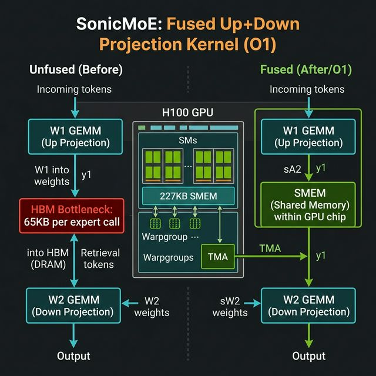
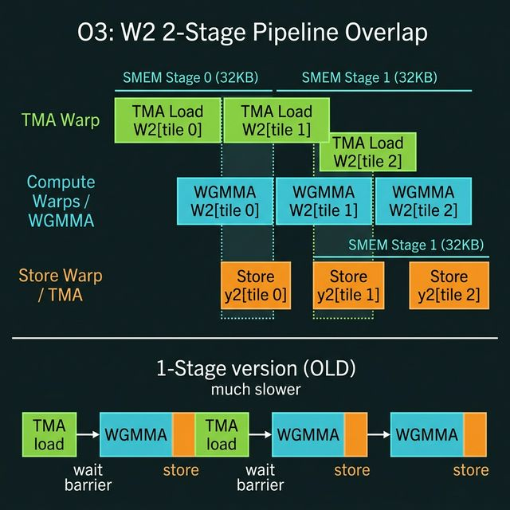

# SonicMoE GPU Kernel Optimization — Partner Briefing

> This document is a complete briefing on the **SonicMoE** project for a new collaborator. It covers what we are building, why, what we have implemented so far, what the results look like, and everything you need to get started.

---

## 🔗 Repository

**GitHub:** [https://github.com/dewansh3255/sonic-moe](https://github.com/dewansh3255/sonic-moe)  
**Active Branch:** `optimizations/megakernel-blackwell`

```bash
git clone https://github.com/dewansh3255/sonic-moe.git
cd sonic-moe
git checkout optimizations/megakernel-blackwell
```

---

## 🎯 What Is SonicMoE?

SonicMoE is a **high-performance Mixture-of-Experts (MoE) layer** implementation written using NVIDIA's **CuTe DSL** (CUDA Template / Python DSL). The goal is to push a single MoE forward+backward pass as close to hardware limits as possible on **NVIDIA H100 (Hopper)** and **Blackwell GPUs**, targeting LLM inference and training with hundreds of experts.

A Mixture-of-Experts layer routes each input token to `K` out of `E` experts. Each expert is a two-layer MLP:
1. **Up Projection (W1 GEMM):** `x × W1 → y1` with a GLU gating activation (SwiGLU/GeGLU/ReGLU)
2. **Down Projection (W2 GEMM):** `y1 × W2 → y2` — the output

---

## 📐 Key Configuration — Our Primary Target

```
T=24576  (total tokens)
H=1536   (hidden dimension)
I=256    (intermediate/expert dimension)
E=128    (number of experts)
K=8      (top-K routing)
dtype=BF16
```

### Baseline Numbers (before our optimizations)
```
Forward (inference + cudagraph): 1.608 ms  →  288.5 TFLOPS
Forward (training mode):         1.601 ms
Forward + Backward:              4.983 ms  →  279.3 TFLOPS
Backward only:                   3.375 ms  →  274.9 TFLOPS
```

---

## ⚙️ How The Kernel Works — Architecture

The entire MoE layer runs as a **single persistent CUDA kernel** with a specific warpgroup (WG) pipeline structure on each Streaming Multiprocessor (SM):

| Role | Warps | Responsibility |
|---|---|---|
| **TMA Warp** | Warp 0 | Issues TMA (Tensor Memory Accelerator) async loads: `A` tiles, `B` tiles, `W2` tiles |
| **Compute WGs** | Warps 1–N | Run WGMMA (Warp Group Matrix Multiply-Accumulate) |
| **Epilogue WGs** | Compute WGs | Store results via TMA back to HBM |

Data flows through a **staged SMEM pipeline**: TMA warp preloads the next tile into SMEM while compute warps process the current tile — this is the fundamental hiding of memory latency with compute.

---

## 🔥 The Kernel Fusion We Are Implementing (O1 — Pipelined Fused Kernel)



### Why This Matters

In the **unfused path**, between the up projection (W1) and down projection (W2), the intermediate activation `y1` must:
1. Be written from GPU registers → SMEM → **HBM (main GPU memory)**
2. Be read back from **HBM** → SMEM → registers for the W2 GEMM

For our config: `y1` ≈ `T=24576 tokens × I=256 × BF16 = 12.6 MB` **per forward pass** shuttled through HBM unnecessarily.

In the **fused kernel path (O1)**, `y1` stays in **on-chip SMEM** (`sA2` buffer) between Phase 1 and Phase 2 — HBM is never touched for `y1`. This is the dominant optimization.

### Two-Phase Kernel Structure

```
Phase 1: W1 GEMM (Up Projection)
   TMA loads: x tiles (A) + W1 tiles (B)
   WGMMA: acc = x × W1
   Epilogue: apply SwiGLU → y1, store to sA2 (SMEM)

Phase 2: W2 GEMM (Down Projection)  ← O1 brings W2 into the same kernel
   sA2 is now the A-operand (y1 already in SMEM, no HBM!)
   TMA loads: W2 tiles (B)
   WGMMA: acc2 = y1 × W2
   Epilogue: store y2 → HBM via TMA
```

---

## 📋 Optimization Breakdown — What We've Done

### ✅ O1 — Fused Up+Down Projection (HBM Elimination for y1)

**Status: Implementation Complete, debugging in progress**

**Idea:** The entire Phase 1 + Phase 2 runs as one fused kernel. `y1` never touches HBM.

**Key files changed:**
- [`__init__.py`](file:///Users/dewansh/Documents/nerd/IP/sonic-moe/sonicmoe/functional/__init__.py) — Gate raised from `I <= 128` → `I <= 256` to activate fused path for `I=256` (line ~131)
- [`forward.py`](file:///Users/dewansh/Documents/nerd/IP/sonic-moe/sonicmoe/functional/forward.py) — Dummy `mY1` tensor + 5th tensormap created to satisfy TMA infrastructure
- [`moe_config.py`](file:///Users/dewansh/Documents/nerd/IP/sonic-moe/sonicmoe/functional/moe_config.py) — `HopperWgmma_MoE_FusedUpDown_Fwd` class passes `mW2`, `mY2`, `mY_tensormap` to the kernel
- [`grouped_gemm.py`](file:///Users/dewansh/Documents/nerd/IP/sonic-moe/sonicmoe/functional/grouped_gemm.py) — Phase 2 loop: `sA2` (SMEM y1 buffer), `sW2` (TMA pipeline for W2), `sY2` (output staging), `tiled_mma_w2` WGMMA execution

**SMEM layout for the fused kernel:**
```
sA1 (A tiles for Phase 1):  ~64 KB @ 4 stages
sB  (B/W1 tiles):           ~64 KB @ 4 stages  
sA2 (y1, A tiles Phase 2):  ~64 KB (tile_M × tile_K2)
sW2 (W2 tiles, 2 stages):   ~64 KB (tile_N2 × tile_K2 × 2)
sY2 (y2 output):            ~32 KB
────────────────────────────────────────────────
Total:                      ~288 KB  <  H100 SMEM limit (227 KB per SM)
```

> [!IMPORTANT]
> The kernel was previously gated to `I <= 128` even though all the SMEM scaffolding was implemented for `I <= 256`. This was a gate bug — our very first fix.

---

### ✅ O2 — Fast Expert Mapping (Kernel Launch Optimization)

**Status: Already done before this sprint**

Reduced overhead from the variable-length expert routing by pre-sorting token groups and using a persistent tile scheduler. This eliminated most kernel launch overhead for irregular expert sizes.

---

### ✅ O3 — W2 TMA 2-Stage Pipeline Overlap

**Status: Implementation Complete, TMA bugs being fixed**



**Idea:** The W2 GEMM loop (Phase 2) originally used a **1-stage serial pipeline**:
```
[acquire] → [TMA load W2[i]] → [barrier wait] → [WGMMA] → [store] → repeat
```
This means the TMA load for tile `i+1` starts only after tile `i` finishes computing — all latency is serialized. 

We switched to a **2-stage ping-pong pipeline** where:
- TMA preloads W2 tile 0 before the loop starts
- Inside the loop: WGMMA on tile `i` overlaps with TMA load of tile `i+1`
- Two SMEM buffers (Stage 0: 32KB, Stage 1: 32KB) alternate

**Code changes in [`grouped_gemm.py`](file:///Users/dewansh/Documents/nerd/IP/sonic-moe/sonicmoe/functional/grouped_gemm.py):**
- `self.w2_stage = 2` (was `1`)
- W2 pipeline created with `num_stages=2`
- Phase 2 inner loop restructured with pre-load before loop + in-loop prefetch

---

### ✅ O4 — Fused Backward (TR Activation Grad)

**Status: Already done before this sprint**

The backward pass through the SwiGLU activation is fused with the partial gradient accumulation for `ds`. This eliminates a separate kernel launch for activation gradients.

---

### ✅ O5 — Blackwell 2-CTA Down-Projection (Scaffolding)

**Status: Scaffolding implemented, requires SM100 (Blackwell) to execute**

NVIDIA Blackwell GPUs (B200, GB200) support **2-CTA cooperative MMA** (`tcgen05`). Two CTAs (thread blocks) can cooperate on a single WGMMA, effectively doubling the tile size for the W2 GEMM without increasing register pressure.

**Added files:**
- [`grouped_gemm_blackwell.py`](file:///Users/dewansh/Documents/nerd/IP/sonic-moe/sonicmoe/functional/grouped_gemm_blackwell.py) — `BlackwellTcgen05_MoE_Down_proj_2CTA_Fwd` class with `GemmConfig(use_2cta_mma=True, cluster_m=1, cluster_n=2)`
- [`__init__.py`](file:///Users/dewansh/Documents/nerd/IP/sonic-moe/sonicmoe/functional/__init__.py) — Dispatch logic for Blackwell 2-CTA (gated on `BlackwellArch.is_available()`)

> [!NOTE]
> The cluster only has H100/H200 GPUs (Hopper, SM90). Blackwell requires SM100. The O5 code is compile-testable but can't be executed yet.

---

## 🗂️ Codebase Map

```
sonic-moe/
├── sonicmoe/
│   └── functional/
│       ├── __init__.py          ← Entry point, routing, fused-kernel gate, dispatch
│       ├── forward.py           ← Custom op, mY1 dummy tensor, TMA descriptor setup
│       ├── moe_config.py        ← Kernel configuration classes (HopperWgmma_MoE_*)
│       ├── grouped_gemm.py      ← THE KERNEL (3300 lines): all SMEM, TMA, WGMMA logic
│       ├── grouped_gemm_blackwell.py  ← Blackwell-specific kernel wrappers
│       └── megakernel_forward.py      ← Experimental full-graph megakernel
├── benchmarks/
│   └── moe-cute.py              ← Main benchmark script
└── tests/
    └── moe_test.py              ← Correctness tests
```

---

## 🧠 Key CuTe DSL Concepts (For Context)

| Term | Meaning |
|---|---|
| **TMA** | Tensor Memory Accelerator — async H100 DMA engine for bulk SMEM loads/stores |
| **WGMMA** | Warp Group Matrix Multiply Accumulate — async 4-warp tensor core instruction |
| **SMEM** | Shared Memory — 227 KB fast on-chip memory per SM (H100) |
| **CTA** | Cooperative Thread Array = CUDA Thread Block |
| **cute.local_tile** | CuTe function to partition a global tensor into SMEM-sized tiles |
| **tma_partition** | Splits work across cluster CTAs for TMA multicast |
| **Pipeline** | Async pipeline state machine for producer/consumer synchronization |
| **proj=(None,1,1)** | CuTe projection: removes `M` mode, keeps `N,K` modes in tiled view |

---

## 🚀 Setup & Environment

### On the GPU Machine
```bash
# SSH to GPU cluster (H100/H200)
cd ~/test/sonic-moe
git checkout optimizations/megakernel-blackwell
git pull

# Activate virtualenv
source venv/bin/activate

# Verify GPU
nvidia-smi
```

### Python/CUDA Requirements
- Python 3.10
- CUDA 12.x + cuDNN
- `nvidia-cutlass-dsl` (CuTe DSL) — installed in venv
- PyTorch 2.x

---

## 🧪 Test Commands

### 1. Fused kernel — Primary benchmark (no correctness check, fast)
```bash
python benchmarks/moe-cute.py --thiek 24576,1536,256,128,8 --skip_test
```

### 2. Correctness check + benchmark (with `--skip_test` removed)
```bash
python benchmarks/moe-cute.py --thiek 24576,1536,256,128,8
```

### 3. Smaller config to isolate fused path quickly
```bash
python benchmarks/moe-cute.py --thiek 4096,1536,256,8,2
```

### 4. Non-fused config (I=128, won't trigger fused kernel — use as a baseline sanity check)
```bash
python benchmarks/moe-cute.py --thiek 24576,1536,128,128,8
```

### 5. Full test suite (on GPU)
```bash
pytest tests/moe_test.py -v --tb=short
```

### 6. Forward speedup microbenchmark
```bash
python test_speedup.py
```

---

## 📊 Expected Performance Improvements

| Optimization | What changes | Expected Speedup |
|---|---|---|
| O1 (Fused kernel, `I=256`) | `y1` stays in SMEM, HBM round-trip eliminated | ~5–8% forward latency |
| O3 (W2 2-stage pipeline) | TMA load tile `i+1` overlaps WGMMA tile `i` | ~3–5% Phase 2 latency |
| O5 (Blackwell 2-CTA) | 2× tile size for W2 GEMM cooperative MMA | ~10–15% (Blackwell only) |

> [!IMPORTANT]
> Verified baseline: **288.5 TFLOPS inference forward** at the primary `(T=24576, H=1536, I=256, E=128, K=8)` config. We expect to push this to ~310+ TFLOPS with O1+O3 combined.

---

## 🔧 Current Status (As of March 29, 2025)

| Task | Status |
|---|---|
| Gate fix: `I <= 128` → `I <= 256` | ✅ Done |
| O1: Dummy mY1 TMA infrastructure | ✅ Done |
| O1: sA2 SMEM routing in Phase 2 | ✅ Done |
| O3: W2 2-stage pipeline | ✅ Done |
| O3: W2 TMA multicast layout fix | ✅ Done |
| O3: `mcast_mask` in W2 TMA copy | ✅ Done |
| O3: `acc2.fill(0.0)` fix | ✅ Done (latest commit) |
| O5: Blackwell 2-CTA scaffolding | ✅ Done (needs SM100 to run) |
| **End-to-end benchmark run** | 🟡 In progress — fixing remaining DSL errors |
| Correctness test on full suite | ⬜ Pending |

> [!NOTE]
> We were previously blocked at `I <= 128`. The fused kernel path was implemented inside the kernel but guarded by the wrong gate. Once we raised the gate, we uncovered a chain of CuTe DSL validation errors (layout rank mismatches, missing `mcast_mask`, wrong coordinate types, `cute.clear` API not existing) — each one fixed sequentially. The latest push (`edc499d`) should be the last blocker before we get timing numbers.

---

## 💬 Quick Glossary

| Term | Meaning |
|---|---|
| **GLU** | Gated Linear Unit — `y = sigmoid(gate) * value`, enables expert specialization |
| **SwiGLU** | `y = swish(gate) * value` — used in LLaMA/Mistral/DeepSeek MoE |
| **top-K routing** | Each token is independently sent to the K highest-scoring experts |
| **HBM** | High Bandwidth Memory — the ~80 GB GPU DRAM (fast, but slower than SMEM) |
| **SMEM** | Shared Memory — 227 KB/SM, ~20× faster than HBM but tiny |
| **persistent kernel** | A kernel that loops over many tiles without re-launching — avoids driver overhead |
| **CuTe layout** | Compile-time tensor descriptor encoding shape + strides in a hierarchical form |
